<h1 align="center">Hi, I'm Huixin</h1>

<p align="center">
  
</p>

<p align="center">
  
</p>

<p align="center">
  <a href="https://github.com/Huixin615">
    
  </a>
  <a href="mailto:enjoyyourlife615@gmail.com">
    
  </a>
</p>

---

### About Me

I care about building AI workflow systems that are understandable, maintainable, and reliable under real use.

Recently, I have been contributing to open-source AI infrastructure, with a focus on backend behavior, scheduler reliability, MCP/tooling boundaries, and review-ready fixes.

```text
current focus:
  - AI agents and workflow orchestration
  - backend architecture and reliability
  - open-source contribution workflows
  - debugging, tests, and maintainable patches
```

---

### Tech Stack

<p align="center">
  
</p>

<p align="center">
  
  
  
  
  
</p>

```text
backend:
  Python, Go, Java, Kotlin, JavaScript, TypeScript
  FastAPI, Redis, RocketMQ, Docker

ai:
  LLM applications, RAG, AI agents, workflow orchestration, MCP tooling
```

<p align="center">
  
</p>

